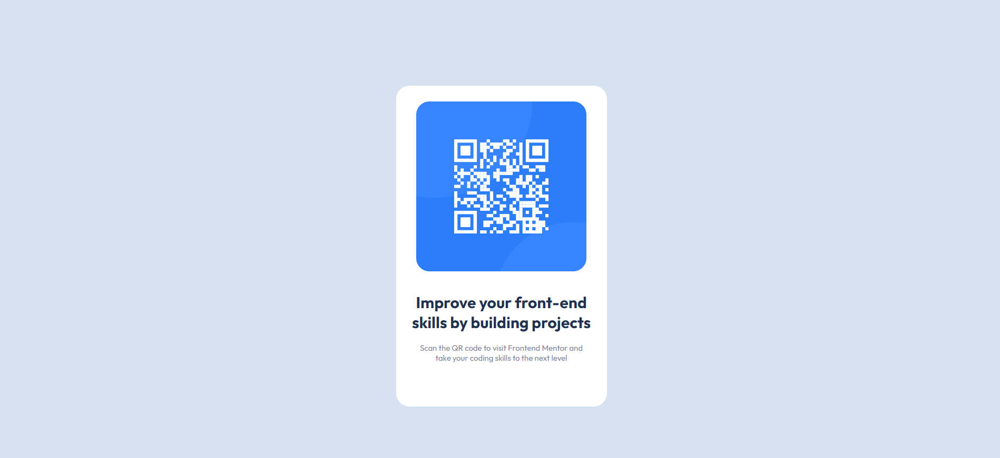

# Frontend Mentor - QR code component solution

This is a solution to the [QR code component challenge on Frontend Mentor](https://www.frontendmentor.io/challenges/qr-code-component-iux_sIO_H). Frontend Mentor challenges help you improve your coding skills by building realistic projects. 

## Table of contents

- [Overview](#overview)
  - [Screenshot](#screenshot)
  - [Links](#links)
- [My process](#my-process)
  - [Built with](#built-with)
  - [What I learned](#what-i-learned)
  - [Continued development](#continued-development)
  - [Useful resources](#useful-resources)
- [Author](#author)

**Note: Delete this note and update the table of contents based on what sections you keep.**

## Overview

### Screenshot

### Links

- Solution URL: [Github Solution](https://github.com/A-R-ZIHAN/qr-code-component)
- Live Site URL: [The Live Site](https://a-r-zihan.github.io/qr-code-component/)

## My process

### Built with

- Semantic HTML5 markup
- CSS custom properties
- Flexbox

### What I learned

How to use the Flexbox property

### Continued development

After this project, I would like to learn how to use CSS Grid. Also, for the backend, I will learn how to do authentication for users.

### Useful resources

- [Code With Harry Flexbox Tutorial](https://www.youtube.com/watch?v=5qVuORLniwM) - This helped me for learning the CSS Flexbox property. I really liked this pattern and will use it going forward.

## Author
- Github - [A-R-ZIHAN](https://github.com/A-R-ZIHAN)
- Frontend Mentor - [@A-R-ZIHAN](https://www.frontendmentor.io/profile/A-R-ZIHAN)

